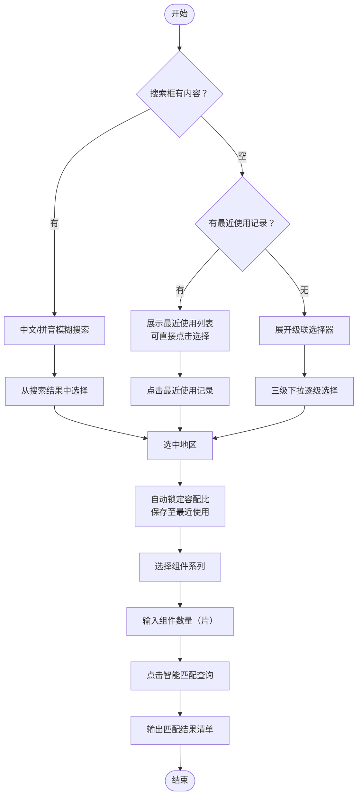
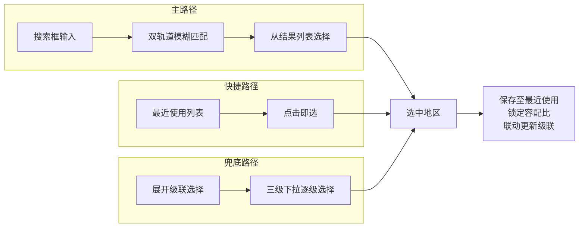
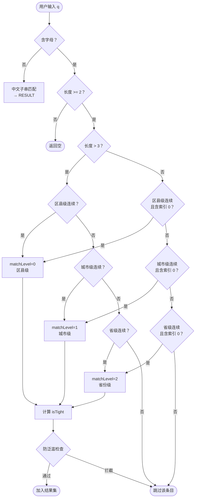
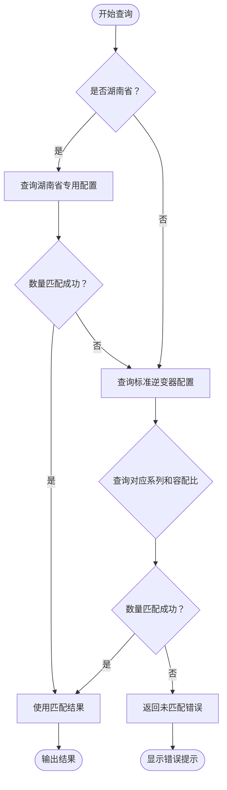
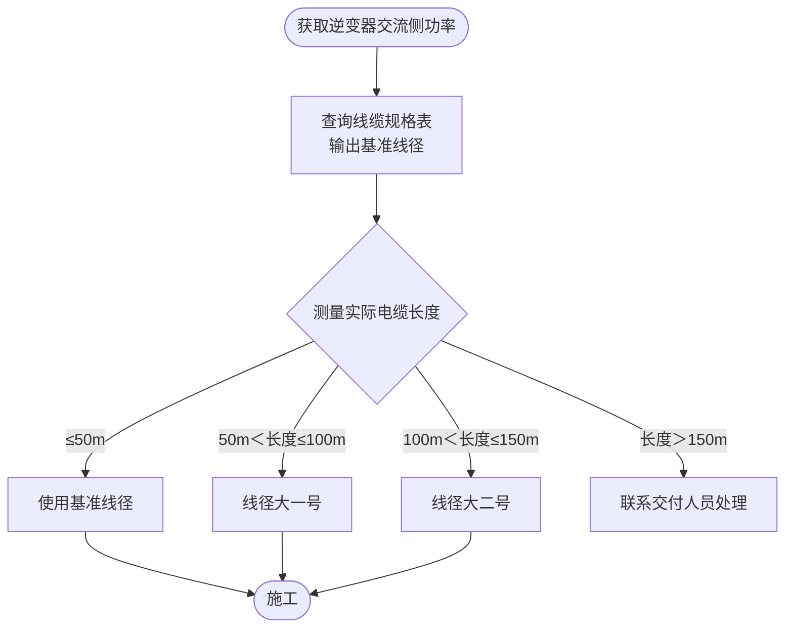

# 组件逆变器-线缆智能匹配查询系统
## 需求规格文档

**版本：** v2.0
**日期：** 2026-05-07
**相关文件：** 全国容配比查询表0407.xlsx
**联系人：** 南部解决方案部 段林钢

---

## 1. 系统概述

本系统是一套面向光伏户用安装人员的**组件-逆变器-线缆智能选型工具**，支持 NEG 715-800W 组件系列。用户通过选择安装地区和输入组件参数，系统自动输出逆变器型号、交流铜线规格、并网箱类型、交流铝线规格四项匹配结果，并附带线缆选型与施工规范说明。

### 1.1 系统架构

系统采用纯前端单文件架构，无后端服务依赖，由以下两层组成：

- **数据维护层**：全国各地区电网接入规范的数据库，是系统所有地区差异化配置的唯一数据来源。Excel 数据表更新后，需通过数据转换流程将最新数据同步至前端查询界面
- **前端查询界面**：用户交互入口，负责地区选择、参数输入、结果展示。所有运行时数据（区域容配比、逆变器匹配表、线缆规格表）内嵌于前端页面中，浏览器本地计算，无需网络请求

### 1.2 核心数据集

| 数据集 | 用途 | 结构概述 |
|--------|------|---------|
| 区域配置数据 | 各地区容配比与并网箱类型 | 以 `省份-城市-区县` 为键，存储并网箱类型与容配比限制 |
| 逆变器匹配数据 | 组件数量→逆变器型号的映射 | 按组件系列×容配比分组，每组为有序配置数组 |
| 湖南省逆变器专用数据 | 湖南省 730 系列的补充挡位 | 按容配比分组，覆盖标准表中未包含的中间数量段 |
| 线缆规格数据 | 逆变器功率→线缆截面的阶梯映射 | 有序数组，按功率上限分档 |
| 省市区县级联索引 | 三级联动下拉菜单的数据源 | 由区域配置数据运行时自动构建 |

---

## 2. 数据表结构

### 2.1 区域配置数据

每条记录对应一个行政区域，包含以下字段：

| 字段 | 类型 | 说明 |
|------|------|------|
| 省份 | 字符串 | 一级行政区名称（组合键第一段） |
| 城市 | 字符串 | 二级行政区名称（组合键第二段） |
| 区县 | 字符串 | 三级行政区名称（组合键第三段） |
| 区域 | 字符串 | 组合唯一键，格式为 `省份-城市-区县`，用于系统内部精确匹配 |
| 并网箱类型 | 字符串/空 | 该地区并网箱类型标签，空值表示未定义 |
| 容配比限制 | 字符串/空 | 该地区容配比限制值，直接驱动逆变器匹配计算；空值表示未定义 |

### 2.2 市级默认行

每个地级市在数据表中均有一条市级默认行，记录该市级别的配置数据。该行不对应真实区县，**不在前端区县下拉菜单中展示**。市级默认行仅作为数据记录存在，不参与区县数据的继承 —— 各区县行独立使用自己的值。

市级默认行的区县字段采用以下标识方式之一：
- 城市名本身回写（如东莞市、中山市等不设市辖区的地级市）
- `"市辖区"`（如厦门市等设有市辖区的地级市）

---

## 3. 用户操作流程



### 3.1 前端交互详细说明

| 操作步骤 | 行为 |
|----------|------|
| 搜索地区（主路径） | 在搜索框输入中文或拼音，从下拉结果列表中直接选择。支持省份、城市、区县三级名称模糊匹配，选中后自动锁定容配比并保存至最近使用列表。 |
| 最近使用（快捷路径） | 搜索框为空时，下方展示最近使用过的地区列表，点击即选。最多保留10条，支持单条删除和清空全部。 |
| 展开地区选择（兜底路径） | 点击"展开地区选择"链接，展开原三级联动下拉菜单。 |
| 选择省份 | 联动刷新城市下拉列表；湖南省自动锁定组件系列为 730W，其他省份展示全部系列 |
| 选择城市 | 联动刷新区县下拉列表；区县列表不包含市级默认行 |
| 选择区县 | 触发容配比自动锁定 |
| 容配比锁定 | 系统自动设置，用户不可修改，控件显示为禁用状态 |
| 选择组件系列 | 未选地区时提示"请先选择地区"；湖南省仅可选 NEG21(730W~740W) |
| 输入组件数量 | 整数，范围 10~330 |
| 智能匹配查询 | 点击查询按钮或在组件数量输入框按回车均可触发 |

### 3.2 输入验证规则

| 验证项 | 规则 | 错误提示 |
|--------|------|----------|
| 组件数量 | 整数，范围 10~330 | "⚠️ 请输入有效数量（10 ~ 330 片）" |
| 匹配失败 | 组件数量不在任何逆变器配置范围内 | "❌ 未找到匹配项，请核对数量或联系技术支持。" |

---

## 3.3 搜索与最近使用详细说明

### 3.3.1 三层交互模型

地区选择采用三级路径设计，按用户使用频率从高到低排列：



| 层级 | 路径 | 操作步数 | 用户场景 |
|------|------|---------|---------|
| 主路径 | 搜索框输入 → 模糊匹配 → 选择 | 1-2 步 | 新用户/偶尔使用 |
| 快捷路径 | 最近使用点击 | 1 步 | 重复使用的安装人员 |
| 兜底路径 | 展开级联 → 三级选择 | 3 步 | 浏览式选择/搜索不到时 |

### 3.3.2 搜索匹配引擎

搜索框是地区选择的主入口，采用**双轨道匹配**策略：

| 输入类型 | 匹配方式 | 示例 |
|---------|---------|------|
| 中文 | 子串包含匹配 | 输入"番禺"匹配"番禺区"；输入"广州"匹配广州市下所有区县 |
| 拼音 | pinyin-pro.match() + 索引连续性校验 | 输入"guangzhou"、"gz"均匹配广州相关地区 |

**输入清洗预处理**：搜索前对用户输入进行标准化处理，提高匹配鲁棒性：
1. 去除非中文字符和非字母字符（保留中文、字母、空格）
2. 连续空白规范为单个空格，去除首尾空白
3. 拼音匹配时提取纯字母部分（去掉中文和空格），转为全小写

| 用户输入 | cleaned（中文匹配用） | pql（拼音匹配用） | 说明 |
|---------|---------------------|-----------------|------|
| `tianhe` | `tianhe` | `tianhe` | 纯拼音 |
| `TianHe` | `TianHe` | `tianhe` | 大小写归一 |
| `tian he` | `tian he` | `tianhe` | 空格去除 |
| `THQ` | `THQ` | `thq` | 纯首字母缩写 |
| `天河` | `天河` | — | 纯中文 |
| `天河区` | `天河区` | — | 纯中文 |
| `广州市gz` | `广州市gz` | `gz` | 混合输入 |

**匹配范围**：所有区域配置数据中的区县级记录（排除市级默认行），匹配维度覆盖区县名、城市名、省份名。

**匹配流程：**



**索引连续性校验（matchConsecutive）**：

拼音查询必须满足 `pinyinPro.match()` 返回的字符索引在原始文本中**连续递增**（`r[j] === r[j-1] + 1`），不允许跨字符跳跃匹配。

| 输入 | 匹配对象 | matchConsecutive 结果 | 说明 |
|------|---------|---------------------|------|
| `gz` | 广州市 | `[0, 1]` → 连续 ✅ | 广(g)州(z)索引连续 |
| `gz` | 广西壮族自治区 | `[0, 2]` → 跳跃 ❌ | 广(g)→西(x)索引 0→2，跳过壮族 |
| `sd` | 山东省 | `[0, 1]` → 连续 ✅ | 山(s)东(d)索引连续 |
| `sd` | 重庆市丰都县 | `[2, 4]` → 跳跃 ❌ | 市(s)→都(d)索引 2→4 |

**短缩写规则（≤3 字符）**：与长查询一致按区县→城市→省份逐级匹配，但各段要求索引 **必须包含 0**（从首字符开始匹配）。长查询无此限制，允许在区段中间匹配。

### 3.3.3 三层匹配级别

| 级别 | 名称 | 匹配对象 | 优先级 | 说明 |
|------|------|---------|--------|------|
| 0 | 区县级 | district | 最高 | 查询与区县名连续拼音匹配 |
| 1 | 城市级 | city | 高 | 查询与城市名连续拼音匹配 |
| 2 | 省份级 | province | 中 | 查询与省份名连续拼音匹配 |

**isTight（紧致匹配）**：指查询字符串是否**连续出现在**匹配区段的**全拼子串**中。

| 输入 | 匹配级别 | 匹配区段 | 区段全拼 | 是否含查询 | isTight |
|------|---------|---------|---------|-----------|---------|
| `gz` | 1（广州） | 广州市 | guangzhoushi | 含 gz（guang→g, zhou→z 交界处） | ✅ |
| `ly` | 1（临沂） | 临沂市 | linyishi | 不含 ly（l...y 不连续） | ❌ |
| `sd` | 2（山东） | 山东省 | shandongsheng | 不含 sd（s...d 不连续） | ❌ |
| `guangzhou` | 1（广州） | 广州市 | guangzhoushi | 含 guangzhou | ✅ |

### 3.3.4 防泛滥限流

拼音匹配到省份或城市时，如果该行政单位下辖大量区县，全部输出会污染结果集。限流规则：

| 匹配场景 | isTight | 限流规则 | 示例 |
|---------|---------|---------|------|
| 区县级 (matchLevel=0) | 不限 | 不限制 | `panyu`→番禺区 |
| 城市级 (matchLevel=1) | ✅ true | 不限制，输出全部区县 | `gz`→广州全部 11 区 |
| 城市级 (matchLevel=1) | ❌ false | 每城市最多 **2** 条区县 | `ly`→临沂仅输出 2 条代表 |
| 省份级 (matchLevel=2) | 不限 | 每省份最多 **1** 条区县 | `sd`→山东仅输出 1 条代表 |

此规则仅适用于拼音匹配（`isPinyin=true`），中文子串匹配不受限。

### 3.3.5 排序规则

```
1. 中文匹配结果 → 优先于拼音匹配结果
2. 按 rank 升序：区县级(0) > 城市级(1) > 省份级(2)
3. 拼音匹配中，isTight=true 优先于 isTight=false
4. 同级别拼音匹配，匹配区段名称字符数少的优先
5. 最终按区县名称字符数升序，相同则按 areaKey 字典序稳定排序
```

**结果上限**：最多展示 10 条。

### 3.3.6 搜索框交互

| 行为 | 规则 |
|------|------|
| 防抖 | 300ms 防抖延迟，避免频繁搜索 |
| 输入长度 | 拼音 >= 2 字符触发搜索；中文 >= 1 字符触发 |
| 搜索结果为空 | 显示 "未找到匹配地区，请展开地区选择" |
| 清空搜索框 | 恢复初始状态：容配比恢复为 1.2 倍（正常超配）禁用态，省/市/区县下拉框清空 |
| 搜索结果展示 | 完整路径格式 "广东省广州市番禺区"，每条标注匹配类型标签（区县匹配/城市匹配/省份匹配/模糊） |

### 3.3.7 搜索结果选中后行为

1. 搜索框显示选中地区名称（如"番禺区"）
2. 系统按容配比直接映射规则自动锁定容配比
3. 联动更新省/市/区县下拉框的选中状态
4. 该地区自动保存至最近使用列表
5. 触发组件系列联动刷新（湖南省特殊逻辑不变）

### 3.3.8 最近使用管理

| 项目 | 说明 |
|------|------|
| 存储方式 | 浏览器 localStorage，key 为 `recentDistricts` |
| 存储格式 | `[{areaKey, selectedAt}]`，仅存区域标识和时间戳 |
| 上限 | 最多 10 条，同一地区仅保留最新一次选择 |
| 排序 | 按选择时间倒序 |
| 展示位置 | 搜索框下方，仅在搜索框为空且存在最近使用记录时展示 |
| 展示格式 | 完整路径，"广东省广州市番禺区" |
| 交互 | 点击即选；每条右侧有删除按钮（×）；底部"清空记录"链接 |
| 静默降级 | localStorage 不可用时自动隐藏，不影响核心功能 |

### 3.3.9 拼音搜索实现

引入 `pinyin-pro` 库（CDN 加载），使用 `match()` 函数进行拼音匹配：

| 匹配场景 | 输入 | 预期行为 |
|---------|------|---------|
| 全拼匹配 | `guangzhou` | 匹配广州市下全部区县（城市级，紧致） |
| 拼音首字母 | `gz` | 匹配区县级 GZ（广宗/光泽/公主岭等），区县级优先占满 10 条 |
| 非紧致缩写 | `gzs` | 匹配广州市，但仅输出 2 条区县（城市级，非紧致） |
| 短缩写 | `ly` | 匹配临沂/洛阳/辽源，各输出最多 2 条（城市级，非紧致） |
| 区县级缩写 | `sd` | 匹配区县级 SD（顺德/商都/山丹等），区县级优先占满 10 条 |
| 不匹配 | `xyzxyz` | 无结果 |

**搜索索引性能优化**：页面加载时预构建搜索索引，每条记录预存 `{ fullName, province, city, district, areaKey }`，避免每次搜索时重复进行拼音转换。索引排除市级默认行（`区县 === 城市名` 或 `区县 === "市辖区"`）。

---

## 4. 组件系列定义

系统支持以下三个组件系列：

| 系列代码 | 前端显示名 | 单片功率范围 | 可用地区 |
|----------|------------|-------------|----------|
| NEG21_715 | NEG21 (715W~720W) | 715W~720W | 除湖南省外所有地区 |
| NEG21_730 | NEG21 (730W~740W) | 730W~740W | 所有地区 |
| NEG22_800 | NEG22 (790W~800W) | 790W~800W | 除湖南省外所有地区 |

**湖南省特殊限制：** 当用户选择湖南省时，组件系列下拉菜单仅展示 NEG21(730W~740W) 一个选项，不展示 715W 和 800W 系列。

---

## 5. 核心计算逻辑

### 5.1 参与计算的核心变量

| 变量 | 来源 | 作用 |
|------|------|------|
| 容配比 | 区域配置数据 → 地区查询 | 决定逆变器额定功率上限 |
| 组件数量 | 用户输入 | 匹配逆变器配置范围 |
| 组件系列 | 用户选择 | 确定使用哪套逆变器配置表 |

### 5.2 逆变器匹配数据结构

逆变器配置数据按 **组件系列 × 容配比** 分组存储，每组内为有序数组，每条记录包含：

| 字段 | 说明 |
|------|------|
| 数量范围 | `[最小片数, 最大片数]` 闭区间 |
| 逆变器组合 | 逆变器型号，多台用 `+` 连接，如 `"30+30"` 表示2台30kW逆变器 |
| 并网箱功率 | 并网箱额定功率（kW），取值包括 25、30、50、100、150、200 |

### 5.3 逆变器匹配查询流程



**匹配规则：** 按数组顺序遍历，找到第一条 `组件数量 >= 最小片数 && 组件数量 <= 最大片数` 的记录即为匹配结果。

### 5.4 湖南省专用逆变器配置

湖南省使用独立的 730 系列配置表，包含标准配置表中未覆盖的中间挡位：

| 容配比 | 数量范围（片） | 逆变器组合 | 并网箱功率(kW) |
|--------|-------------|-----------|---------------|
| 1.2倍(正常) | 65~68 | 17+25 | 50 |
| 1.2倍(正常) | 69~72 | 20+25 | 50 |
| 1.2倍(正常) | 73~76 | 17+30 | 50 |
| 1.1倍 | 60~62 | 17+25 | 50 |
| 1.1倍 | 63~66 | 20+25 | 50 |
| 1.1倍 | 67~69 | 17+30 | 50 |
| 1倍 | 55~56 | 17+25 | 50 |
| 1倍 | 57~60 | 20+25 | 50 |
| 1倍 | 61~63 | 17+30 | 50 |

**查询优先级：** 湖南省优先查询专用配置，未命中则回退到标准 NEG21_730 配置。

#### 5.4.1 张家界市专项配置

张家界市（永定区、武陵源区、慈利县、桑植县）使用独立配置表，在标准湖南省配置基础上做如下调整：

| 调整内容 | 操作 |
|---------|------|
| 42kW 档位（17+25） | 并入 45kW 档位（20+25），合并后的数量范围覆盖原两档总和 |
| 47kW 档位（17+30） | 替换为单台 50kW 三相逆变器 |

| 容配比 | 数量范围（片） | 逆变器组合 | 并网箱功率(kW) |
|--------|-------------|-----------|---------------|
| 1.2倍(正常) | 65~72 | 20+25 | 50 |
| 1.2倍(正常) | 73~76 | 50 | 50 |
| 1.1倍 | 60~66 | 20+25 | 50 |
| 1.1倍 | 67~69 | 50 | 50 |
| 1倍 | 55~60 | 20+25 | 50 |
| 1倍 | 61~63 | 50 | 50 |

### 5.5 逆变器型号规格

系统使用的逆变器型号包括以下单台规格：

| 额定功率 | 电流类型 |
|---------|---------|
| 8kW | 单相/三相 |
| 10kW | 单相/三相 |
| 12kW | 三相 |
| 15kW | 三相 |
| 17kW | 三相 |
| 20kW | 三相 |
| 25kW | 三相 |
| 30kW | 三相 |
| 33kW | 三相 |
| 36kW | 三相 |
| 40kW | 三相 |
| 50kW | 三相 |

### 5.6 单相逆变器特殊处理

当匹配结果为单台 8kW 或 10kW 逆变器时，系统按**单相/三相双配置**模式输出：

| 输出项 | 单相配置 | 三相配置 |
|--------|---------|---------|
| 逆变器 | XkW单相 | XkW三相 |
| 并网箱 | 10kW单相 | 25kW三相 |
| 交流铜线 | 3×10 mm² | 3×10+2×6 mm² |
| 交流铝线 | 2×16 mm² | 3×16+1×10 mm² |

**判断条件：** 逆变器组合仅含1台，且功率为 8kW 或 10kW。

### 5.7 不参与计算的字段

**并网箱类型**不参与上述任何计算，仅在计算完成后，将对应地区的并网箱类型名称作为备注附加到结果清单中输出。修改并网箱类型不影响逆变器型号和线缆规格的计算结果。

---

## 6. 容配比自动锁定机制

### 6.1 映射规则

用户完成区县选择后，系统查询区域配置数据的容配比限制值，按以下规则锁定容配比，用户不可手动修改：

| 容配比限制值 | 锁定结果 | 业务含义 |
|-------------|---------|---------|
| `不超配1` | 1倍（不超配） | 电网要求严格，逆变器功率不得超过组件总功率 |
| `不超配1.1` | 1.1倍（轻度超配） | 允许轻度超配 |
| 空值 | 1.2倍（正常超配） | 无特殊限制，按公司标准最大超配比执行 |

**映射逻辑：**
```
if 值为空 → 锁定为 1.2倍(正常超配)
if 值包含 "1.1" → 锁定为 1.1倍(轻度超配)
if 值包含 "1" → 锁定为 1倍(不超配)
其他 → 锁定为 1.2倍(正常超配)
```

### 6.2 容配比选项

系统预设三个容配比选项：

| 选项 | 前端显示 | 说明 |
|------|---------|------|
| 1.2倍(正常) | 1.2倍 (正常超配) | 默认选项 |
| 1.1倍 | 1.1倍 (轻度超配) | — |
| 1倍 | 1倍 (不超配) | — |

### 6.3 直接映射规则

系统取消层级继承，采用**一一对应**的直接映射规则：用户选定区县后，直接读取该区县行在数据表中的容配比限制值，不再向市级或省级默认行回退。

**映射逻辑：**

```text
if 值为空 → 锁定为 1.2倍(正常超配)
if 值包含 "1.1" → 锁定为 1.1倍(轻度超配)
if 值包含 "1" → 锁定为 1倍(不超配)
其他 → 锁定为 1.2倍(正常超配)
```

**关键变化：** 区县行的空值不再继承市级或省级默认行的值，空值统一视为"无特殊限制"，锁定为 1.2 倍正常超配。

### 6.4 典型示例

| 地区 | 数据表值 | 锁定结果 |
|------|---------|---------|
| 广东省广州市番禺区 | `不超配1` | 1倍不超配 |
| 河北省唐山市开平区 | `不超配1.1` | 1.1倍轻度超配 |
| 江西省鹰潭市贵溪市 | 空 | 1.2倍正常超配 |
| 吉林省长春市农安县 | 空 | 1.2倍正常超配 |

---

## 7. 匹配结果输出

### 7.1 输出项定义

系统匹配成功后，在结果面板中展示以下信息：

| 输出项 | 数据来源 | 说明 |
|--------|---------|------|
| 逆变器配置 | 匹配结果的逆变器组合字段 | 多台逆变器用 `+` 连接，后缀"kW 三相"；8kW/10kW 单台为双配置 |
| 逆变器交流铜线 | 根据各逆变器功率查线缆规格表 | 多台逆变器分行显示；8kW/10kW 单台为双配置 |
| 并网箱配置 | 匹配结果的并网箱功率字段 | 输出并网箱功率（kW）；8kW/10kW 单台为双配置 |
| 并网箱交流铝线 | 根据逆变器总功率查线缆规格表 | 按逆变器总功率查表；8kW/10kW 单台为双配置 |
| 备注 | 区域配置数据的并网箱类型字段 | 仅当值非空且不等于"标准"时显示，格式为"备注：{并网箱类型}" |
| 功率超限警告 | 逆变器总功率判断 | 逆变器总功率 > 100kW 时显示 |

### 7.2 多台逆变器线缆计算

当匹配结果为多台逆变器（组合中包含 `+`）时：

- **铜线**：按每台逆变器的额定功率分别查线缆规格表，分行显示各台铜线规格
- **铝线**：按所有逆变器额定功率之和（总功率）查线缆规格表，显示一行铝线规格
- **逆变器显示**：显示组合 + "kW 三相"，如 "30+30kW 三相"

### 7.3 警告信息

当逆变器总功率 > 100kW 时，在结果下方显示黄色警告框：

> ⚠️ 公共机构及组件功率超 100kW 的并网箱需自行采购，自采元器件需符合公司白名单要求

---

## 8. 并网箱类型配置机制

### 8.1 功能定位

并网箱类型字段的唯一作用是：**在匹配结果清单下方以备注形式输出类型名称**，供安装人员采购和施工参考。它不影响逆变器选型，不影响线缆计算，不影响并网箱功率输出。

### 8.2 直接映射规则

并网箱类型取消层级继承，采用**一一对应**的直接映射规则：用户选定区县后，直接读取该区县行在数据表中的并网箱类型值，不再向市级或省级默认行回退。

**映射逻辑：**

```text
if 值为空 或 值为"标准" → 备注项不显示
if 值非空且非"标准" → 输出 "备注：{值}"
```

**关键变化：** 区县行的空值不再继承市级或省级默认行的值。

### 8.3 并网箱类型枚举

当前数据表中存在以下并网箱类型，按地域分布归类：

**标准类**（安徽、湖北、海南、吉林等省份）
- `标准`
- `标准-（30~50KW）加大`（安庆太湖县、宣城宣州区）
- `标准-（36~50KW）加大`（广东省大部分地市）
- `标准-（40~50KW）加大`（湖北省襄阳市）

**刀闸类**（浙江全省、江苏部分、湖南大部）
- `双刀闸`（浙江全省、江苏淮安/连云港等、安徽六安霍邱县）
- `双刀闸（30KW-50KW使用60KW箱子）`（湖南省主流配置）
- `SMC双刀闸漏保版`（浙江湖州长兴县）
- `双刀闸漏保版`（特定地区）

**福建/三遥类**（福建省及部分跨省地区）
- `福建版`（福建大部、江苏常州、湖南娄底等）
- `三遥`（福建省福州长乐区、漳州市、莆田市、宁德部分县、广东省潮州市等）

**RDC类**（江苏、安徽部分地区）
- `单刀RDC`（河北廊坊霸州市）
- `单刀RDC（36KW以上配60KW并网箱）`（江苏南京市级默认）
- `单刀RDC（50KW配60KW并网箱）`（安徽池州贵池区）
- `单刀RDC（25KW并网箱换成30KW）（36KW以上配60KW并网箱）`（安徽池州青阳县、铜陵义安区）

**分体类**（河北省为主）
- `塑壳分体`（河北保定、邯郸、衡水、石家庄、邢台等）
- `金属分体`（河北承德、廊坊、秦皇岛等，以及吉林少数区县）

**特殊类**
- `无并网箱`（河北唐山丰南区、路南区）

---

## 9. 线缆选型规范

### 9.1 线缆规格阶梯表

以下规格表对所有地区统一适用，按逆变器功率（kW）阶梯匹配：

| 功率上限 (kW) | 交流铜线规格 | 交流铝线规格 |
|-------------|------------|------------|
| ≤20 | 3×10+2×6 mm² | 3×16+1×10 mm² |
| ≤33 | 3×16+2×10 mm² | 3×25+1×10 mm² |
| ≤50 | 3×25+2×16 mm² | 3×35+1×16 mm² |
| ≤60 | 3×35+2×16 mm² | 3×50+1×25 mm² |
| ≤70 | 3×50+2×25 mm² | 3×70+1×35 mm² |
| ≤80 | 3×50+2×25 mm² | 3×70+1×35 mm² |
| ≤90 | 3×70+2×35 mm² | 3×95+1×50 mm² |
| ≤100 | 3×70+2×35 mm² | 3×95+1×50 mm² |
| ≤125 | 3×95+1×50 mm² | 3×120+1×70 mm² |
| ≤160 | 3×120+1×70 mm² | 3×150+1×70 mm² |
| >160 | 3×120+1×70 mm² | 3×150+1×70 mm² |

**匹配规则：** 按功率上限从小到大遍历，找到第一条 `逆变器功率 ≤ 功率上限` 的记录即为匹配结果；若超过所有上限，使用最后一条记录的规格。

### 9.2 电缆长度调整规范

根据实际电缆长度，在基准线径基础上做如下调整：



### 9.3 施工规范

系统固定展示以下施工规范，不依赖数据查询，对所有地区统一适用：

1. 逆变器输出线必须使用铜线（ZR-YJV-0.6/1kV）
2. 交流电缆长度 ≤50m，线径参考表格标准
3. 50m ＜ 长度 ≤100m，线径比规定**大一号**
4. 100m ＜ 长度 ≤150m，线径比规定**大二号**
5. 长度 ＞150m，请联系交付人员处理

**附加要求：** 并网时电气负责人务必在场，确保线缆线径符合要求，进出口有效封堵，铝出线需使用铜铝端子。

> **特殊说明：** 公共机构及组件功率超 100kW 的并网箱需自行采购，自采元器件须符合公司白名单要求。

---

## 10. 省份覆盖范围

系统数据覆盖全国以下省份/直辖市/自治区：

安徽省、北京市、福建省、甘肃省、广东省、广西壮族自治区、贵州省、海南省、河北省、河南省、湖北省、湖南省、吉林省、江苏省、江西省、辽宁省、内蒙古自治区、宁夏回族自治区、山东省、山西省、陕西省、上海市、四川省、天津市、新疆维吾尔自治区、云南省、浙江省

---

## 11. 数据维护操作规范

### 11.1 修改容配比限制

| 操作场景 | 操作方法 | 注意事项 |
|---------|---------|---------|
| 修改单个区县 | 直接修改该区县行的容配比限制值 | 该值直接影响选型计算结果 |
| 批量修改 | 在 Excel 中批量编辑或按筛选批量更新 | 每个区县行独立生效，互不影响 |

> **注意：** 容配比采用一一对应关系，每个区县行独立使用自己的值。修改市级默认行不会影响下属区县的容配比值。

### 11.2 修改并网箱类型

| 操作场景 | 操作方法 | 注意事项 |
|---------|---------|---------|
| 修改单个区县 | 直接修改该区县行的并网箱类型值 | 填入第 8.3 节枚举值之一 |
| 新增并网箱类型 | 填入新类型名称 | 须同步更新本文档第 8.3 节枚举列表，并确认前端展示逻辑兼容新命名 |
| 清空并网箱类型 | 将该区县行的并网箱类型值清空 | 清空后该区县备注项不显示 |

> **注意：** 并网箱类型采用一一对应关系，每个区县行独立使用自己的值。修改市级默认行不会影响下属区县的并网箱类型。

### 11.3 数据同步

前端页面中的区域配置数据为 Excel 数据表的静态转换产物。Excel 数据表更新后，需重新执行数据转换流程，将最新数据同步至前端页面。

---

## 12. 前端界面规格

### 12.1 页面标题与副标题

- **标题**：组件逆变器-线缆查询
- **副标题**：支持NEG 715-800w组件，有疑问处请联系南部解决方案部段林钢

### 12.2 输入区域

采用 3 列网格布局，移动端适配为 2 列：

| 位置 | 控件类型 | 标签 | 默认值/提示 |
|------|---------|------|-----------|
| 全宽行 | 搜索输入框 | 搜索地区 | placeholder: "🔍 搜索地区（支持中文/拼音）" |
| — | 折叠区展开链接 | 展开地区选择 | 点击后展开下方三级下拉菜单 |
| 第1列（折叠） | 下拉选择 | 省份 | "请选择" |
| 第2列（折叠） | 下拉选择 | 城市 | "请选择"（联动） |
| 第3列（折叠） | 下拉选择 | 区县 | "请选择"（联动，不包含市级默认行） |
| 第4列 | 下拉选择 | 容配比 (自动锁定) | 1.2倍 (正常超配)（禁用） |
| 第5列 | 下拉选择 | 组件系列 | "请先选择地区"（联动） |
| 第6列 | 数字输入 | 组件数量 (片) | 提示"请输入整数"，最小值10，最大值330 |

> **说明**：搜索结果展示为搜索框下方的独立下拉区域，非传统下拉菜单样式。省/市/区县三级联动在页面加载时折叠隐藏，通过"展开地区选择"链接手动展开，选中地区后自动与搜索框同步。

### 12.3 查询按钮

- 文本："智能匹配查询"
- 全宽蓝色主按钮
- 支持点击和组件数量输入框回车触发

### 12.4 结果面板

- **默认隐藏**，匹配成功后以淡入动画显示
- 4 个结果框采用 2×2 网格布局（移动端单列）

| 结果框 | 标签 |
|--------|------|
| 逆变器配置 | 逆变器配置 |
| 交流铜线 | 逆变器交流铜线 |
| 并网箱配置 | 并网箱配置 |
| 交流铝线 | 并网箱交流铝线 |

- **备注区域**：仅当并网箱类型非空且非"标准"时显示
- **警告区域**：仅当逆变器总功率 > 100kW 时显示

### 12.5 选型与施工规范面板

固定显示在页面底部，蓝色信息框样式，包含 5 条线缆长度规范和 1 条施工注意事项。

### 12.6 搜索与最近使用前端规格

#### 12.6.1 搜索框控件规格

| 属性 | 值 |
|------|-----|
| 控件类型 | 文本输入框（带清除按钮） |
| 位置 | 输入区域顶部，全宽行 |
| Placeholder | `🔍 搜索地区（支持中文/拼音）` |
| 防抖 | 300ms |
| 搜索触发 | 输入文字后防抖到期自动触发 |
| 结果展示 | 搜索框下方独立下拉区域，非浏览器原生下拉菜单样式 |
| 结果上限 | 10 条 |
| 结果格式 | 完整路径，如 `广东省广州市番禺区` |
| 结果为空 | 显示 "未找到匹配地区，请展开地区选择" |
| 选中后文本显示 | 显示地区短名（如"番禺区"） |
| 清除按钮 | 点击清空搜索框，恢复初始状态 |
| 键盘支持 | ↑/↓ 键导航结果列表，Enter 键确认选中，Esc 键关闭结果列表 |

#### 12.6.2 搜索结果下拉样式

搜索框下方展示圆角卡片式下拉面板，每条结果高亮匹配文字，悬停/选中时高亮背景色。下拉面板宽度与搜索框对齐，最多占可视高度 60%，超出滚动。

#### 12.6.3 最近使用区域规格

| 属性 | 值 |
|------|-----|
| 出现条件 | 搜索框为空，且 localStorage 中存在最近使用记录 |
| 位置 | 搜索框下方 |
| 最大条数 | 10 |
| 排序 | 按选择时间倒序（最新在前） |
| 展示格式 | 完整路径，"广东省广州市番禺区" |
| 单条操作 | 点击选中该地区；右侧 ✕ 按钮单条删除 |
| 批量操作 | 底部 "清空记录" 文字链接 |
| 数据降级 | localStorage 不可用时不展示，不影响其他功能 |

#### 12.6.4 三种路径的关系

| 路径 | 触发场景 | 操作步数 | 选中后同步行为 |
|------|---------|---------|--------------|
| 搜索框选择 | 用户主动输入搜索 | 1-2 步 | 更新级联下拉框状态、锁定容配比、保存最近使用 |
| 最近使用点击 | 搜索框聚焦/为空 | 1 步 | 同上 |
| 级联选择 | 用户展开级联并选择 | 3 步 | 更新搜索框文本、锁定容配比、保存最近使用 |

无论通过哪种路径选中地区，最终状态完全一致：锁定容配比、组件系列联动刷新、最近使用列表更新。

---

## 13. 关键约束与边界条件

- **一一对应原则：** 每个区县行独立使用自己在数据表中的值，空值视为"无特殊限制"，不继承市级或省级默认值
- **计算独立性：** 并网箱类型修改不影响任何计算结果，容配比修改直接影响逆变器型号匹配
- **政策依据要求：** 修改容配比前须确认该地区电网接入政策依据，不得随意调整
- **市级默认行标识：** 市级默认行不在前端下拉菜单中展示
- **区域键唯一性：** "区域"列的组合键须保持全局唯一，新增地区时须遵循 `省份-城市-区县` 格式
- **湖南省特殊约束：** 湖南省仅支持 730W 组件系列，使用独立的逆变器匹配表
- **单相逆变器约束：** 8kW 和 10kW 单台逆变器按单相/三相双配置输出，铜线和铝线规格均为固定值
- **组件数量边界：** 输入范围 10~330 片，超出范围拒绝查询
- **功率超限警告：** 逆变器总功率 > 100kW 触发并网箱自采警告
- **搜索排他性：** 搜索结果和最近使用均排除市级默认行，市级默认行仅作为数据记录存在，不可直接选中
- **拼音库依赖：** 拼音搜索依赖 `pinyin-pro` 库（CDN 加载），页面首次加载时需联网获取该库
- **最近使用存储：** 最近使用数据存储在浏览器 localStorage 中，清除浏览器缓存或隐私模式可能丢失该数据，属于预期行为，不影响核心查询功能
